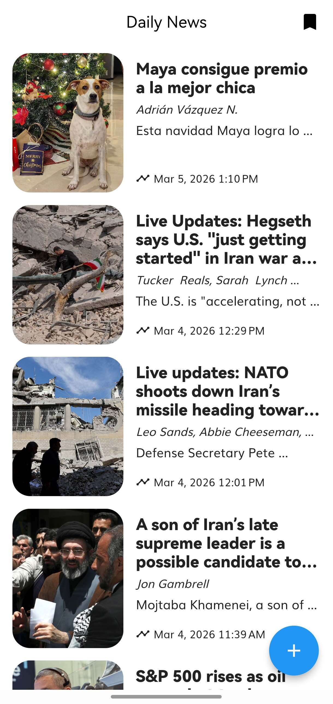
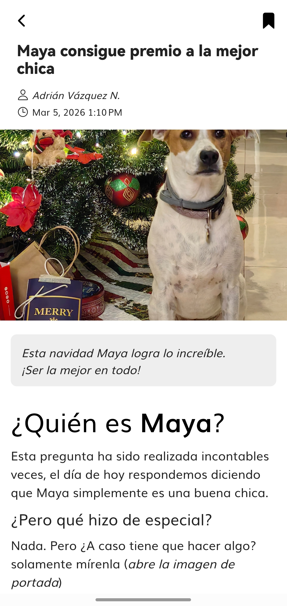
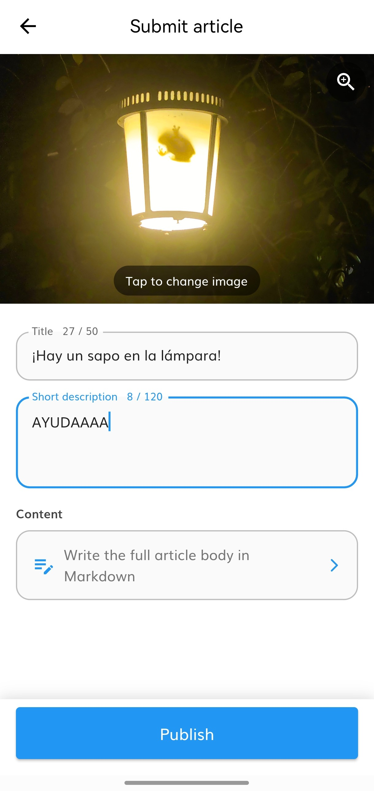
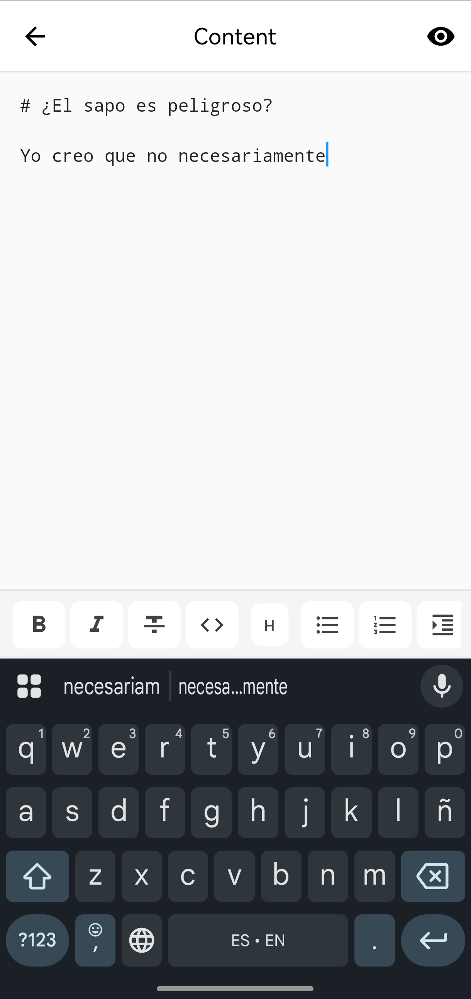
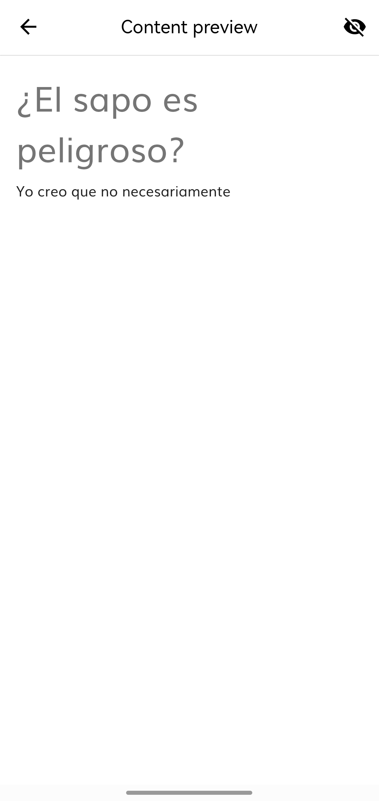
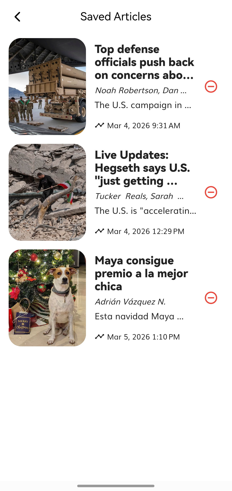

## 1. Introducción

Al iniciar el análisis del proyecto pude ver patrones que a pesar de tener experiencia con ellos, me encontré con variantes que no había conocido. Anteriormente he trabajado con Clean Architecture donde hay un solo Domain, Presentation, Data. En este caso el trabajar por features me parece que hace que sea más atómico el proyecto pero mi sensación es que de forma no tan bien manejada puede generar una duplicidad de entidades, funciones o demás características porque es muy complicado llevar el control de cada feature teniendo consciente las demás.

Haciendo pruebas con el repositorio y la aplicación me di cuenta de las muchas mejoras que pueden haber.Aunque actualmente solo existen dos features y una de ellas ya estaba programada; me di cuenta de muchas inconsistencias y detalles de experiencia de usuario hechas a medias.

En toda la aplicación realicé refactorizaciones de como se devuelven los datos en los UseCases, cambios visuales y en experiencia de usuario, mejor presentación de datos (como fechas, autores, entre otros), cambios de QoL (al guardar un artículo solo se guarde una vez) y pulimiento en sensación al usar la app (BouncyScrollPhysics en Home, Swipe down para hacer refresh, Lightbox para abrir las imágenes, entre otros)

De cualquier manera, el uso y aprendizaje de este patrón de programación, el uso de librerías nuevas junto con la experiencia que he tenido previamente hacen que sea entretenido el trabajar y mejorar este repositorio de prueba.

## 2. Viaje de aprendizaje

Dentro de lo que cabe el principal aprendizaje que tuve fue el manejo de Bloc y Cubit ya que es una librería que no había usado con anterioridad y sí implicó un aprendizaje desde 0 entendiendo el concepto y su utilidad. Me parece una librería excelente que definitivamente vale la pena aprender y seguir implementando en proyectos futuros.

Con las demás librerías he tenido experiencia aunque más moderada, donde tuve más complicaciones fue en librerías como retrofit generator o floor ya que son tan antiguas las versiones manejadas que hubieron muchas complicaciones en la generación de sus archivos.

Mi opinión personal es que creo que en la actualidad hay librerías que ofrecen de forma más sencilla y moderna el manejo de bases de datos y llamadas a Api, pero eso ya depende de la decisión y conveniencia del proyecto.

Otro aprendizaje de 0 que tuve fue todo lo relacionado a Firebase, tanto de su uso, como emuladores, como la configuración inicial que se hace en flutter y su manejo para subir archivos, llamadas a get y demás puntos usados.

A pesar de que me hubiera gustado adentrarme al área de testing (la cual considero muy importante), por cuestión de tiempo e inversión que ya he hecho en este repositorio, no lo implementé. Pero considero un aprendizaje valioso los recursos compartidos (ya ando en proceso de ver el video).

Todo fue resuelto y aprendido a base de Youtube, Google e Inteligencia Artificial para entender conceptos y aprender formas.

## 3. Desafíos enfrentados

El principal reto fue la resolución de errores derivados de la antigüedad de este proyecto. Actualmente estoy usando una distro atómica de Linux, haciendo que mi principal forma de programar sea a través de contenedores. Este enfoque me gusta mucho ya que mantiene limpia mi instalación de OS y permite tener control atómico de lo que se necesita para reducir errores, por lo tanto, cualquier persona que quiera usar este repositorio, usando el devcontainer debe ahorrarse una gran parte de problemas relacionados a versión de Flutter y Dart incompatibles con las librerías estipuladas en pubspec.yaml, ya que existen muchas librerías atascadas en Dart 2 y que generar inconsistencias con Floor que no ha sido actualizado.

Igualmente tuve que arreglar el versionamiento de algunas librerías ya que no funcionaban correctamente las versiones estipuladas (probablemente por no encontrar la versión de Flutter correcta), por lo tanto, tuve que hacer adaptación de algunas versiones.

Este problema de versiones y Flutter fue lo que más tiempo me llevó (8 horas aproximadamente), ya que no hay mucha definición de estos problemas en internet y tuve que ser más un trabajo de debug y comprensión de Logs de errores.

Una vez solucionado correctamente esos errores pude avanzar con rapidez en la tarea asignada, donde me encontré con otro error igual de pesado de solucionar.

Firebase es una herramienta que nunca he usado, no estoy aconstumbrado a sus SDK ni la forma en que se maneja ya que vengo acostumbrado a REST Apis personalizadas por mi, esa fue una curva de aprendizaje interesante pero el mayor problema fue realizar la conexión al emulador ya que estoy usando WayDroid como emulador principal y Firebase cambia el ip de llamada a los emuladores por defecto en Android, la solución al final fue este código.

```dart
firestore.useFirestoreEmulator(
  host,
  8080,
  //Needs to be false because i'm not using Android Emulator
  automaticHostMapping: false,
);
```
Este snippet desactiva el Mapeo automático, permitiendo poner la ip hacia mi computadora y permitiendo la conexión al emulador de Firebase.

Otros problemas que me enfrenté son que el código inicial no estaba completamente diseñado para ser usado con Firebase, cosas como DataState estaban determinadas por Dio y sus errores, por lo tanto, necesitaba encontrar otra solución. Pensaba usar de cualquier forma una manera adaptada de DataState o una especial para Firebase, pero para gusto personal, no me gustan esas inconsistencias o variantes ya que a la larga generan confusión.

Mi solución fue encontrar una forma centralizada de recibir errores y éxitos, terminé creando lo siguiente:

```dart
abstract class Failure {
  final String message;
  const Failure(this.message);
}
//This failure is used when the server returns an error
class ServerFailure extends Failure {
  const ServerFailure(super.message);
}

//This failure is used when an unexpected error is caught
class UnexpectedFailure extends Failure {
  const UnexpectedFailure(super.message);
}

//This failure is used when the network is not available
class NetworkFailure extends Failure {
  const NetworkFailure(super.message);
}

//This failure is used when the cache is not available
class CacheFailure extends Failure {
  const CacheFailure(super.message);
}

//This failure is used when the user is not authorized
class UnauthorizedFailure extends Failure {
  const UnauthorizedFailure(super.message);
}
```

Este patrón centraliza todos los posibles errores que una operación puede tener en la app, tanto para APIs, cache, red, errores inesperados o fallos por permisos y hay un mappeador para errores específicos por librería como Dio o Firebase.

Al final el resultado es una función como esta:

```dart
Future<Either<Failure, List<ArticleEntity>>> getNewsArticles() async {}
```
El Either permite determinar el resultado para la izquierda o derecha, si es izquierda es Failure y si es Derecha entonces devuelve el objeto.

Entonces en Bloc tenemos implementaciones tan elegantes como:
```dart
final result = await _getArticleUseCase();
result.fold(
  (failure) => emit(RemoteArticlesError(failure.message)),
  (articles) => emit(RemoteArticlesDone(articles)),
);
```
Decidí refactorizar el código anterior para usar este patrón de errores y que esté más centralizado.


## 4. Reflexión y dirección a futuro

En general, la experiencia de trabajar en este proyecto fue muy enriquecedora tanto a nivel técnico como profesional. A nivel técnico:

- Consolidé el uso de principios SOLID y Clean Architecture en un proyecto de prueba, no solo a nivel teórico.
- Mejoré mi capacidad para modelar entidades de dominio y separar responsabilidades entre capas.
- Profundicé en patrones de manejo de errores, validaciones y flujos asincrónicos.

A nivel profesional:

- Practiqué la planificación incremental de funcionalidades, priorizando los casos de uso de mayor impacto.
- Desarrollé una disciplina mayor en cuanto a consistencia de código, nombrado y estructura de módulos.
- Aprendí a seguir códigos de arquitectura, patrones ya establecidos y mejorarlos en el proceso.

Para futuras iteraciones del proyecto, algunas direcciones interesantes serían:

- Extender la cobertura de pruebas automatizadas (unitarias, de integración y, si aplica, de UI).
- Incorporar métricas y logging más detallados para analizar el uso real de la aplicación.
- Mejoraría todavía más a nivel de interfaz las pantallas para generar una mejor experiencia de usuario.
- Añadiría características nueva como poder subir más imágenes, editar artículos. Igual a nivel de código establecer una sola base de datos o migrar a otra solución usando SharedPreferences o librerías como Orange Database que en mi opinión es una excelente alternativa, limpia y sin complicaciones para el nivel de datos que se maneja actualmente.

## 5. Pruebas del projecto

En esta sección se incluyen evidencias visuales del estado final de la Applicant Showcase App:

- **Capturas de pantalla**:
  - Pantalla principal de noticias / artículos.
  

  - Detalle de un artículo con su contenido completo.
  

  - Flujo de envío de un nuevo artículo (formulario de creación/edición):

    - 
      *Esta imagen muestra el formulario principal donde el usuario edita los campos principales para crear o editar un artículo antes de enviarlo, cuenta con guardado de borrador automático*

    - 
      *Aquí se evidencia la funcionalidad para previsualizar una imagen de portada. El usuario puede cambiar la imagen y ver cómo quedará en el resultado final.*

    - 
      *En esta captura se observa el editor de contenido, donde el usuario puede escribir en formato Markdown usando ayuda visual y botones para dar formato, listas, títulos, etc.*

    - 
      *Esta imagen muestra la vista previa en tiempo real del contenido en formato Markdown, permitiendo al usuario revisar cómo se verá el artículo final antes de publicarlo.*
  -Pantalla de artículos guardados
  

- **Videos de demostración**:
  - Recorrido completo por la aplicación mostrando la navegación entre pantallas.
  [Ver grabación de pantalla](./screenshots/screenrecording.mp4)

## 6. Overdelivery

En esta sección documento las funcionalidades adicionales y prototipos que van más allá de los requisitos mínimos del proyecto.

### 6.1 Nuevas características implementadas

- **Borradores de artículos**:
  - Funcionalidad: permite guardar un artículo en estado de borrador de forma automática antes de publicarlo definitivamente, con un indicador a la derecha que indica que se está guardando y un debouncer de 500ms para evitar sobrecarga al momento de escribir.
  - Propósito: evitar la pérdida de información cuando el usuario aún no está listo para publicar o necesita revisar su contenido más tarde.
  

- **Editor de contenido de Markdown**:
  - Funcionalidad: dentro de la edición del artículo se diseñó otra pantalla donde se tienen las herramientas y atajos para crear el texto con formado Markdown junto con un previsualizador.
  - Propósito: el texto del artículo es más personalizado y ofrece al usuario una mayor comodidad al escribir y ver el formato final
  

- **Previsualizador de imagen**:
  - Funcionalidad: ya que los artículos tienen imágenes la mayoría del tiempo y debido a como está diseñado el widget no se ve en su totalidad, se implementó un previsualizador de imagen a pantalla completa.
  - Propósito: poder visualizar la imagen dada con comodidad y dar una mejor experiencia de usuario
  

- **Arreglos generales**:
  - Funcionalidad: la aplicación contaba con muchas deficiencias para ser útil, entre ellas estaban:
    - Al momento de guardar un artículo podías guardarlo múltiples veces generando que la lista de guardados crezca sin razón.
    - Discordancia entre cómo cargaban las imágenes a veces se usaba CachedNetworkImage o Image.Network
    - Mejoramiento de widget de noticias permitiendo visualizar formato MD si no hay alguna descripción, mostrar autores y mostrar con formato apropiado y adecuado a tu zona horaria la fecha y hora
    - Mejora en transiciones de página pasando a utilizar CupertinoPage en la mayoría de las páginas
    - En ArticleDetail se pulió diseño mostrando autor, fecha bien escrita, el ícono de guardar ser puso en la parte superior para hacer un diseño menos estorboso, la descripición se puso de manera destacada para que se note que es descripción y se permite la visualización de Markdown desde dentro del contenido.
  - Propósito: generar una mejor experiencia de usuario haciendo cambios mínimos que propician mejor interacción y menos fricción con el producto

### 6.2 ¿Cómo se podría mejorar esto?

De cara al futuro, esta aplicación tiene muchísimas áreas de mejora.

- **Actualización y refactorización de proyecto completo**:
  - Actualmente el proyecto es muy antiguo usando versiones descontinuadas de Dart y Flutter, el hecho de actualizarlas y actualizar las librerías evitaría problemas a futuro y haría que algunas áreas o procesos sean menos pesados.

- **Autenticación de usuario**:
  - Por cuestiones de tiempo, desarrollo y propósito final en este momento cualquier persona con la aplicación puede crear un artículo sin ningún problema, es recomendable aplicar algún tipo de autenticación para que haya solo espectadores y escritores. Por el momento cualquier persona que suba un artículo aparecerá como Adrián Vázquez N. de autor.

- **Mejoras generales**:
  - Se me ocurren mejoras en general como:
    - Botón para compartir artículos que tengan un url.
    - Galería de fotos donde los artículos puedan tener más de una foto
    - Mejoramiento del editor Markdown, dando comodidades como revisión de ortografía, añadir documentos, enlaces o imágenes dentro del contenido.
    - Añadir indicador si un artículo está guardado.
    - Hacer una interfaz de home diferente con artículos más grandes para que se vea mejor la información de cada artículo
    - Hacer una interfaz más destacable en colores o personalizada para que la aplicación tenga una identidad.